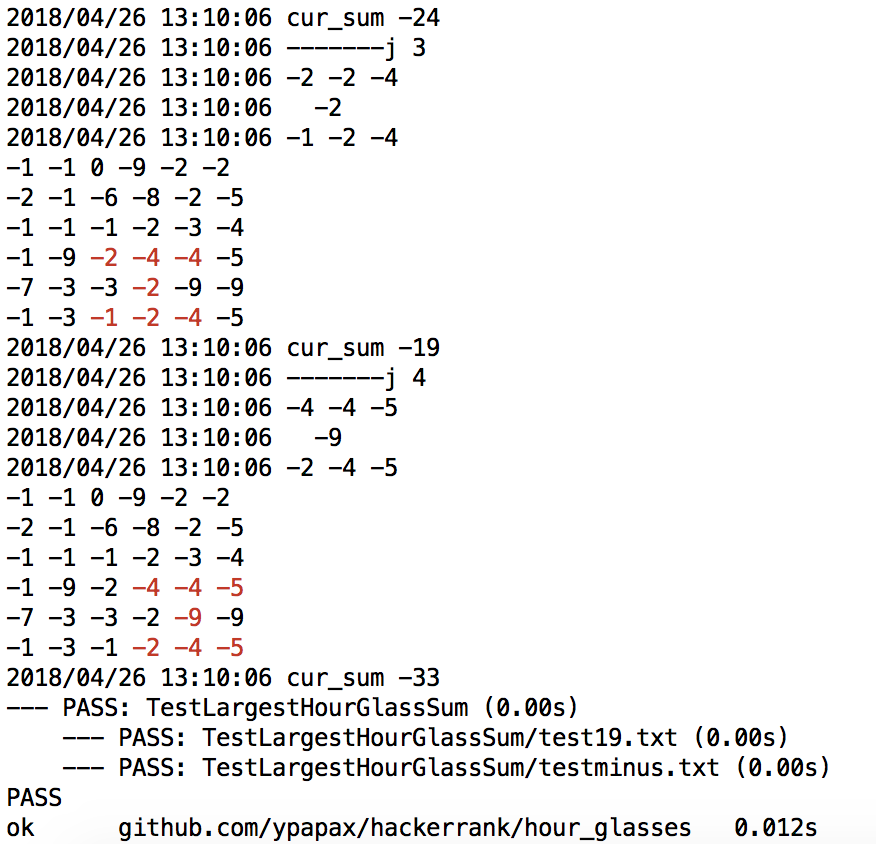

[Task](https://www.hackerrank.com/challenges/30-2d-arrays/problem)

Calculate the hourglass sum for every hourglass in , then print the maximum hourglass sum.

```
$ ./run.sh 2>/dev/null
19

```

```
$ go test -v

--- PASS: TestLargestHourGlassSum (0.00s)
    --- PASS: TestLargestHourGlassSum/test19.txt (0.00s)
    --- PASS: TestLargestHourGlassSum/testminus.txt (0.00s)
PASS
ok  	github.com/ypapax/hackerrank/hour_glasses	0.012s
```
